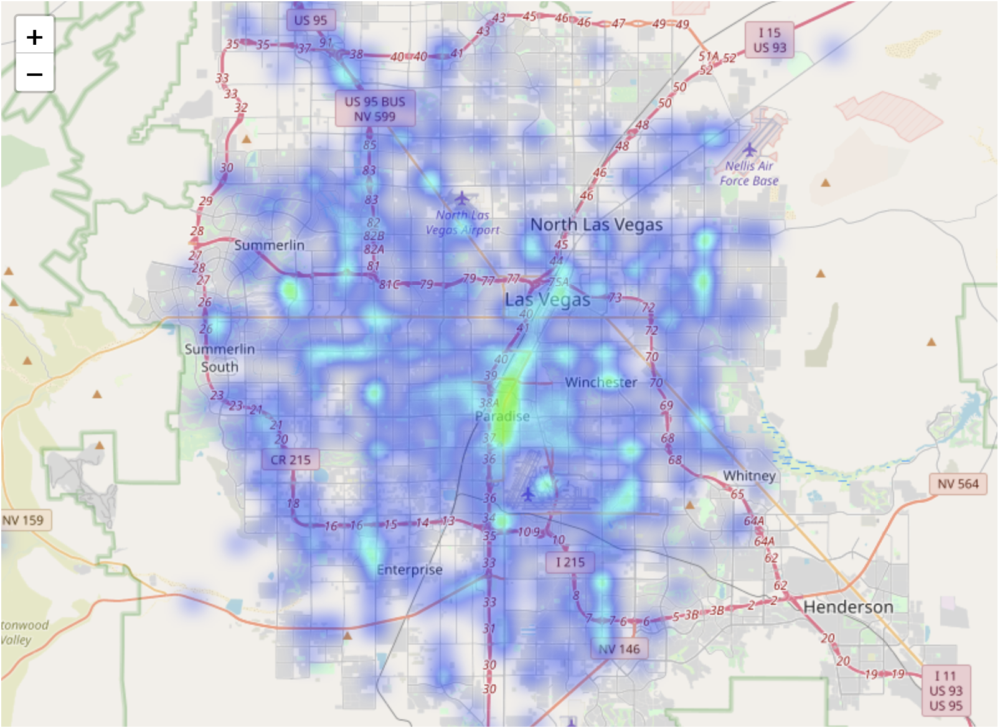
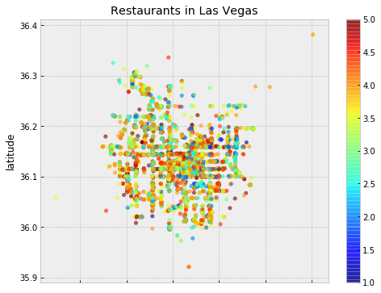
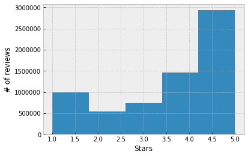
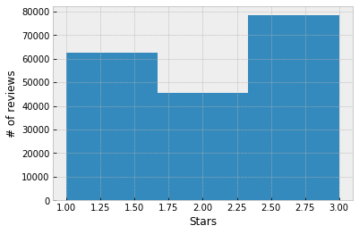

# Customer Voice


**Predict sentiment using text features from labelled customer reviews**

People are tend to give 4~5 stars for the review but in the sentence they wrote,  

there could be differ. Let's make a model to determine number of stars from text.


## Data Understanding

### YELP Open Dataset


#### Builiding an initial database with json files

There are several json files on data set from Yelp( https://www.yelp.com/dataset ),
upload to mongodb with

> mongoimport

And build some indexs on the mongodb collections with

> db.collection.createIndex

Dataset has Business, Reviews, Pictures for 10 Metropolitan areas.

#### Import necessary libraries


```python
import pymongo
import pandas as pd
import numpy as np
import matplotlib.pyplot as plt
import folium
plt.style.use('bmh')

from sklearn.feature_extraction.text import TfidfVectorizer
from sklearn.feature_extraction import stop_words
from sklearn.model_selection import train_test_split
from sklearn.linear_model import LogisticRegression
from sklearn.metrics import log_loss
from sklearn.pipeline import Pipeline
```

#### Setup for accessing database


```python
mc = pymongo.MongoClient()
db = mc['yelp']
```


```python
business_coll = db['business']
review_coll = db['review']
```

#### Shapes of Data

Business Collection


```python
# how many business?
business_coll.count_documents({})
```


    192609


```python
# what's inside?
cur = business_coll.find({})
next(cur)
```


    {'_id': ObjectId('5ced65b1ba8666cdc2af7fa8'),
     'business_id': 'xvX2CttrVhyG2z1dFg_0xw',
     'name': 'Farmers Insurance - Paul Lorenz',
     'address': '15655 W Roosevelt St, Ste 237',
     'city': 'Goodyear',
     'state': 'AZ',
     'postal_code': '85338',
     'latitude': 33.4556129678,
     'longitude': -112.3955963552,
     'stars': 5.0,
     'review_count': 3,
     'is_open': 1,
     'attributes': None,
     'categories': 'Insurance, Financial Services',
     'hours': {'Monday': '8:0-17:0',
      'Tuesday': '8:0-17:0',
      'Wednesday': '8:0-17:0',
      'Thursday': '8:0-17:0',
      'Friday': '8:0-17:0'}}


```python
# how many states?
states = business_coll.find({}).distinct("state")
print(states)
```

    ['AZ', 'ON', 'NC', 'AB', 'NV', 'OH', 'PA', 'QC', 'WI', 'IL', 'NY', 'SC', 'TX', 'UT', 'NM', 'FL', 'CA', 'VA', 'BAS', 'NE', 'AK', 'XGM', 'WA', 'XWY', 'CON', 'BC', 'GA', 'VT', 'CT', 'AL', 'DUR', 'TN', 'NJ', 'AR', 'XGL', 'DOW']


```python
# how many cities?
cities = business_coll.find({}).distinct("city")
len(cities)
```


    1204


A lot of Cities in the dataset,

we choose Las Vegas because there are a lot of visitors.


```python
# how many businesses in Las Vegas?
business_coll.count_documents({'city':'Las Vegas'})
```


    29370


```python
# how many restaurants in Vegas?
business_coll.count_documents({'categories':{"$regex": u"Restaurants"}, 
                               'city':'Las Vegas'})
```


    6450


```python
# Get restaurants in vegas to Data Frame
vegas_cur = business_coll.find({'categories':{"$regex": u"Restaurants"}, 
                               'city':'Las Vegas'})
vegas_df = pd.DataFrame(list(vegas_cur))
```


```python
vegas_df.head()
```


<div>
<style scoped>
    .dataframe tbody tr th:only-of-type {
        vertical-align: middle;
    }

    .dataframe tbody tr th {
        vertical-align: top;
    }

    .dataframe thead th {
        text-align: right;
    }
</style>
<table border="1" class="dataframe">
  <thead>
    <tr style="text-align: right;">
      <th></th>
      <th>_id</th>
      <th>address</th>
      <th>attributes</th>
      <th>business_id</th>
      <th>categories</th>
      <th>city</th>
      <th>hours</th>
      <th>is_open</th>
      <th>latitude</th>
      <th>longitude</th>
      <th>name</th>
      <th>postal_code</th>
      <th>review_count</th>
      <th>stars</th>
      <th>state</th>
    </tr>
  </thead>
  <tbody>
    <tr>
      <th>0</th>
      <td>5ced65b1ba8666cdc2af7fc0</td>
      <td>6055 E Lake Mead Blvd</td>
      <td>{'BikeParking': 'True', 'BusinessParking': '{'...</td>
      <td>tstimHoMcYbkSC4eBA1wEg</td>
      <td>Mexican, Restaurants, Patisserie/Cake Shop, Fo...</td>
      <td>Las Vegas</td>
      <td>{'Monday': '11:0-21:0', 'Tuesday': '10:0-21:0'...</td>
      <td>1</td>
      <td>36.195615</td>
      <td>-115.040529</td>
      <td>Maria's Mexican Restaurant &amp; Bakery</td>
      <td>89156</td>
      <td>184</td>
      <td>4.5</td>
      <td>NV</td>
    </tr>
    <tr>
      <th>1</th>
      <td>5ced65b1ba8666cdc2af7fc5</td>
      <td>1775 E Tropicana Ave, Ste 29</td>
      <td>{'OutdoorSeating': 'False', 'BusinessAcceptsCr...</td>
      <td>PZ-LZzSlhSe9utkQYU8pFg</td>
      <td>Restaurants, Italian</td>
      <td>Las Vegas</td>
      <td>None</td>
      <td>0</td>
      <td>36.100016</td>
      <td>-115.128529</td>
      <td>Carluccio's Tivoli Gardens</td>
      <td>89119</td>
      <td>40</td>
      <td>4.0</td>
      <td>NV</td>
    </tr>
    <tr>
      <th>2</th>
      <td>5ced65b1ba8666cdc2af7ff2</td>
      <td>6125 Spring Mountain Rd</td>
      <td>{'RestaurantsPriceRange2': '1', 'Ambience': '{...</td>
      <td>kANF0dbeoW34s2vwh6Umfw</td>
      <td>Fast Food, Food, Restaurants, Ice Cream &amp; Froz...</td>
      <td>Las Vegas</td>
      <td>None</td>
      <td>0</td>
      <td>36.125031</td>
      <td>-115.225620</td>
      <td>Dairy Queen</td>
      <td>89146</td>
      <td>33</td>
      <td>2.0</td>
      <td>NV</td>
    </tr>
    <tr>
      <th>3</th>
      <td>5ced65b1ba8666cdc2af8015</td>
      <td>4343 N Rancho Dr</td>
      <td>None</td>
      <td>X8mtoSxY8whtmbDlj0D3Aw</td>
      <td>Restaurants, Chinese</td>
      <td>Las Vegas</td>
      <td>None</td>
      <td>1</td>
      <td>36.238596</td>
      <td>-115.233331</td>
      <td>Imperial Asian Buffet</td>
      <td>89030</td>
      <td>4</td>
      <td>2.0</td>
      <td>NV</td>
    </tr>
    <tr>
      <th>4</th>
      <td>5ced65b1ba8666cdc2af8033</td>
      <td>Artisan Hotel, 1501 W Sahara Ave</td>
      <td>{'RestaurantsAttire': ''dressy'', 'Corkage': '...</td>
      <td>bJP4l_BGq2CudEu0m-wNjg</td>
      <td>Restaurants, Pizza, Italian, American (New)</td>
      <td>Las Vegas</td>
      <td>{'Monday': '16:0-0:0', 'Tuesday': '16:0-0:0', ...</td>
      <td>0</td>
      <td>36.143672</td>
      <td>-115.169792</td>
      <td>Artisan Fine Dining Room</td>
      <td>89102</td>
      <td>3</td>
      <td>2.0</td>
      <td>NV</td>
    </tr>
  </tbody>
</table>
</div>


```python
# Draw Heatmap with review_count for business
from folium import plugins
from folium.plugins import HeatMap
from folium.plugins import MarkerCluster
import branca.colormap as cm

s = vegas_df.loc[:, ['latitude', 'longitude', 'review_count']]
data=s.loc[:, ['latitude', 'longitude', 'review_count']]

map = folium.Map(location=[vegas_df['latitude'].median(),
                           vegas_df['longitude'].median()], 
                 zoom_start=9,
                 width=800, height=800)

heat_df = data[['latitude', 'longitude', 'review_count']]

# List comprehension to make out list of lists
heat_data = [[row['latitude'],row['longitude']] for index, row in heat_df.iterrows()]

# Plot it on the map
plugins.HeatMap(heat_data, radius=8).add_to(map)
map.fit_bounds(map.get_bounds())

map
```


```python
# how stars are spread on the map
vegas_df.plot(kind='scatter', 
              x='longitude', 
              y='latitude',
              c=vegas_df['stars'], 
              cmap=plt.get_cmap('jet'), 
              colorbar=True,
              alpha=0.6,
              title='Restaurants in Las Vegas',
              figsize=(8, 6));
```





Review Collection


```python
# how many reviews?
review_coll.count_documents({})
```


    6685900


```python
# what is inside of review?
cur = review_coll.find({})
next(cur)
```


    {'_id': ObjectId('5ced66f9ba8666cdc2b7f848'),
     'review_id': '2TzJjDVDEuAW6MR5Vuc1ug',
     'user_id': 'n6-Gk65cPZL6Uz8qRm3NYw',
     'business_id': 'WTqjgwHlXbSFevF32_DJVw',
     'stars': 5.0,
     'useful': 3,
     'funny': 0,
     'cool': 0,
     'text': "I have to say that this office really has it together, they are so organized and friendly!  Dr. J. Phillipp is a great dentist, very friendly and professional.  The dental assistants that helped in my procedure were amazing, Jewel and Bailey helped me to feel comfortable!  I don't have dental insurance, but they have this insurance through their office you can purchase for $80 something a year and this gave me 25% off all of my dental work, plus they helped me get signed up for care credit which I knew nothing about before this visit!  I highly recommend this office for the nice synergy the whole office has!",
     'date': '2016-11-09 20:09:03'}


#### Let's check the stars on reviews


```python
# Get all stars in reviews
cursor = review_coll.find({})

stars = [review['stars'] for review in cursor]
len(stars)
```


    6685900


```python
# Historam of stars for all reviews

plt.xlabel('Stars')
plt.ylabel('# of reviews')
plt.hist(stars, bins=5);

```





#### What is differ stars on business and review


```python
# Check with Restaurants in Vegas
# Get stars on Business and
# Get stars of average on Reviews for the Business
cur = business_coll.find({'categories':{"$regex": u"Restaurants"}, 
                          'city':'Las Vegas'})

print('Business', '   Average of reviews')
print('-------------------------------')
for i, doc in enumerate(cur):
    review_cur = review_coll.find({
        'business_id': doc['business_id']
    })
    stars = 0
    counts = 0
    for review in review_cur:
        stars += review['stars']
        counts += 1
        
    print(doc['stars'], '       ', stars/counts)
    
    # for only 10 business
    if i == 10:
        break
```

    Business    Average of reviews
    -------------------------------
    4.5         4.301587301587301
    4.0         4.097560975609756
    2.0         2.242424242424242
    2.0         1.75
    2.0         2.0
    3.0         2.9661016949152543
    3.5         3.6482504604051567
    4.5         4.666666666666667
    4.5         4.666666666666667
    3.5         3.6785714285714284
    4.0         4.012820512820513


#### Make an review_dataframe for Trainging/Testing Classifier


```python
# get_reviews function
def get_reviews(category = u'Restaurants', 
                city='Las Vegas', 
                max_business_count = 1000):    
    '''Return reviews list for category/city'''

    cursor = business_coll.find({'categories': {"$regex": category},  
                                 'city':city})

    review_list = []
    count = 0
    for doc in cursor:
        review_cur = review_coll.find({
            'business_id': doc['business_id']
        })

        # Do it for only max_count
        count +=1
        if count == max_business_count:
            break

        # Just extract stars and text from review
        for review in review_cur:
            data = {}
            data['stars'] = review['stars']
            data['text'] = review['text']
            review_list.append(data)

    return review_list
```

#### Build Data Set for Training Classifier

Start with review for 1000 business


```python
review_df = pd.DataFrame(get_reviews())
```


```python
review_df.head()
```


<div>
<style scoped>
    .dataframe tbody tr th:only-of-type {
        vertical-align: middle;
    }

    .dataframe tbody tr th {
        vertical-align: top;
    }

    .dataframe thead th {
        text-align: right;
    }
</style>
<table border="1" class="dataframe">
  <thead>
    <tr style="text-align: right;">
      <th></th>
      <th>stars</th>
      <th>text</th>
    </tr>
  </thead>
  <tbody>
    <tr>
      <th>0</th>
      <td>4.0</td>
      <td>We found out about this gem from The Man's co-...</td>
    </tr>
    <tr>
      <th>1</th>
      <td>3.0</td>
      <td>The "chips" are a fried corn tortilla which we...</td>
    </tr>
    <tr>
      <th>2</th>
      <td>4.0</td>
      <td>The pollo mole is well worth the trip out here...</td>
    </tr>
    <tr>
      <th>3</th>
      <td>3.0</td>
      <td>I've ordered Caldo de Rez from here twice and ...</td>
    </tr>
    <tr>
      <th>4</th>
      <td>5.0</td>
      <td>My boyfriend doesn't like Mexican food yet he ...</td>
    </tr>
  </tbody>
</table>
</div>


#### Write some functions to check performance of model


```python
def get_accuracy(labels, predicts):
    '''Return probability of accuray'''
    count = 0
    total = 0

    for i, value in enumerate(labels):
        if value == predicts[i]:
            count += 1
        total = i+1

    return count / total
```


```python
def check_model(pipeline, dataframe, test_size=0.2, random_state=42):
    '''Return performance of pipeline with dataframe'''
    # set train & test variables
    X_train, X_test, y_train, y_test = train_test_split(dataframe['text'], 
                                                        dataframe['target'], 
                                                        test_size=test_size, 
                                                        random_state=random_state)
    
    # fit to model
    pipeline.fit(X_train, y_train)
    
    # predict with test data
    test_pred_val = pipeline.predict(X_test)
    test_pred_prob = pipeline.predict_proba(X_test)

    # predict with train data
    train_pred_val = pipeline.predict(X_train)
    train_pred_prob = pipeline.predict_proba(X_train)

    # calculate performance of model
    test_accuracy = get_accuracy(y_test, test_pred_val)
    test_logloss = log_loss(y_test, test_pred_prob)
    
    train_accuracy = get_accuracy(y_train, train_pred_val)
    train_logloss = log_loss(y_train, train_pred_prob)

    # return result
    return ({
        'test_accuracy': test_accuracy,
        'test_logloss': test_logloss,
        'train_accuracy': train_accuracy,
        'train_logloss': train_logloss
    })
    
```


```python
# Parameters for TF-IDF vectorize
ngrams_1 = {
    'ngram_range': (1, 1),
    'stop_words': 'english',
    'dtype': 'int32',
    'strip_accents': 'unicode',
    'decode_error': 'replace',
    'analyzer': 'word',
    'min_df': 2
}
```

Base model with TFIDF-Logistic Regression


```python
pp_1n_logi = Pipeline([
    ('tfidf', TfidfVectorizer(ngrams_1)),
    ('classifier', LogisticRegression(solver='liblinear',
                                      multi_class='ovr'))
])
```


```python
review_df['target'] = review_df['stars']
```


```python
# test model with check_model function
first_test = check_model(pp_1n_logi, review_df)

```


```python
first_test
```


    {'test_accuracy': 0.6495568090249798,
     'test_logloss': 0.8448144293305668,
     'train_accuracy': 0.7058582575645658,
     'train_logloss': 0.7572538215738449}


### Change target to 3 categories

First model is not bad, but need to be improved.<br>
There are a lot more 4, 5 stars than 1, 2, 3 stars, <br>
Set 1, 2, 3 stars to 'Bad', 4 stars to 'Neutral', 5 stars to 'Good'


```python
# set new "class" column 
review_df['target'] = 'Bad'
review_df.loc[review_df['stars'] == 5, 'target'] = 'Good'
review_df.loc[review_df['stars'] == 4, 'target'] = 'Neutral'
```


```python
# array for histogram
hist_data = []
for target in review_df['target']:
    if target == 'Good':
        hist_data.append(3)
        continue
    if target == 'Neutral':
        hist_data.append(2)
        continue
    if target == 'Bad':
        hist_data.append(1)
```


```python
# Draw histogram for Bad/Neutral/Good
plt.xlabel('Stars')
plt.ylabel('# of reviews')
plt.hist(hist_data, bins=3);
```





```python
# another check with model
category3_test = check_model(pp_1n_logi, review_df)
```


```python
# show result
category3_test
```


    {'test_accuracy': 0.7536932581251679,
     'test_logloss': 0.5823332556792181,
     'train_accuracy': 0.787070736915618,
     'train_logloss': 0.528981976414413}


Test with 2-ngrams


```python
ngrams_2 = {
    'ngram_range': (2, 2),
    'stop_words': 'english',
    'dtype': 'int32',
    'strip_accents': 'unicode',
    'decode_error': 'replace',
    'analyzer': 'word',
    'min_df': 2
}
```


```python
pp_2n_logi = Pipeline([
    ('tfidf', TfidfVectorizer(ngrams_2)),
    ('classifier', LogisticRegression(solver='liblinear',
                                      multi_class='ovr'))
])
```


```python
twongrams_test = check_model(pp_2n_logi, review_df)
```


```python
twongrams_test
```


    {'test_accuracy': 0.7536932581251679,
     'test_logloss': 0.5823332556792181,
     'train_accuracy': 0.787070736915618,
     'train_logloss': 0.528981976414413}


#### with MORE reviews


```python
more_review = pd.DataFrame(get_reviews(category='Restaurants', 
                                       city='Las Vegas', 
                                       max_business_count = 4000 ))
```


```python
more_review['target'] = 'Bad'
more_review.loc[more_review['stars'] == 5, 'target'] = 'Good'
more_review.loc[more_review['stars'] == 4, 'target'] = 'Neutral'
```


```python
more_data_test = check_model(pp_1n_logi, more_review)
```


```python
more_data_test
```


    {'test_accuracy': 0.756166426935166,
     'test_logloss': 0.5671105196776742,
     'train_accuracy': 0.7771555096808563,
     'train_logloss': 0.5363666393326931}


#### Export model with Pickle


```python
import pickle
```


```python
with open('cust_voice_model.pkl', 'wb') as f:
    pickle.dump(pp_1n_logi, f) 
```

#### With SelectKBest


```python
from sklearn.feature_selection import SelectKBest
from sklearn.feature_selection import f_classif
```


```python
TOP_K = 20000
```


```python
pp_KBest = Pipeline([
    ('tfidf', TfidfVectorizer(ngrams_2)),
    ('KBest', SelectKBest(f_classif, k=TOP_K)),
    ('classifier', LogisticRegression(solver='liblinear',
                                      multi_class='ovr'))
])
```


```python
kbest20k_test = check_model(pp_KBest, more_review)
```


```python
kbest20k_test
```


    {'test_accuracy': 0.7564594321027116,
     'test_logloss': 0.5673810179242142,
     'train_accuracy': 0.7705761899212547,
     'train_logloss': 0.5464490849144116}


```python
TOP_2K = 2000
```


```python
pp_2KBest = Pipeline([
    ('tfidf', TfidfVectorizer(ngrams_1)),
    ('KBest', SelectKBest(f_classif, k=TOP_K)),
    ('classifier', LogisticRegression(solver='liblinear',
                                      multi_class='ovr'))
])
```


```python
kbest2k_test = check_model(pp_2KBest, more_review)
```


```python
kbest2k_test
```


    {'test_accuracy': 0.7564594321027116,
     'test_logloss': 0.5673810179242142,
     'train_accuracy': 0.7705761899212547,
     'train_logloss': 0.5464490849144116}


#### With XGBOOST MODEL


```python
import xgboost as xgb
import os
os.environ['KMP_DUPLICATE_LIB_OK']='TRUE'
```


```python
pp_clf = Pipeline([
    ('tfidf', TfidfVectorizer(ngrams_1)),
    ('KBest', SelectKBest(f_classif, k=TOP_2K)),
    ('classifier', xgb.XGBClassifier())
])
```


```python
xgb_test = check_model(pp_clf, review_df)
```


```python
xgb_test
```


    {'test_accuracy': 0.6798818157399946,
     'test_logloss': 0.7653447932481422,
     'train_accuracy': 0.6863307323493466,
     'train_logloss': 0.7564591762025}


#### Conclusions 

This is just baseline model testing for customer voice,<br> 
we need to explore more with various data and models.


```python

```
